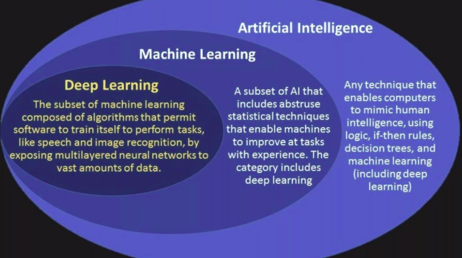
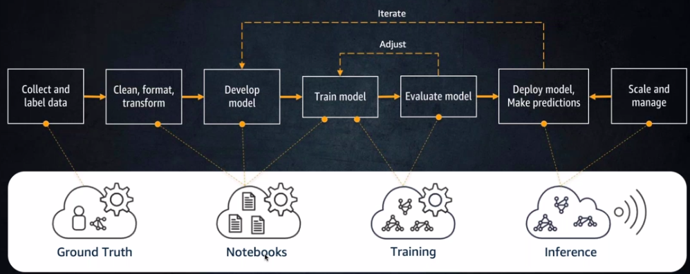

# AWS_ML_webinar
Webinar on machine learning with AWS for Smart India Hackathon

# Intro

AI- anything that mimics human intelligence
ML- abstracts away stat

# ML
- ML is all about prediction.
- Don't code, let the system learn through data. With more data, accuracy of the prediction function increases.

# Types of ML
- Supervised learning: Data is manually labelled
    - Classification: Yes/No
    - Regression: Extrapolating graph
- Unsupervised: No manual labelling but some grouping policy is needed.
    - Clustering
- Reinforcement

# AWS ML stack
1. AI services: rekognition, polly etc
2. ML services: sagemaker
3. ML frameworks and infra(need detailed knowledge): Deep learning AMIs etc

# AI services
1. Rekognition: image recognition
2. Polly: text to speech
3. Comprehend: Extract insights from text(keyphases, sentiments, entities)

# ML services
Sagemaker: 

1. Groundtruth: easy instructions for labelling
2. Notebooks: Like Jupyter notebooks but come with ML libraries
3. Training: Readymade algorithms

